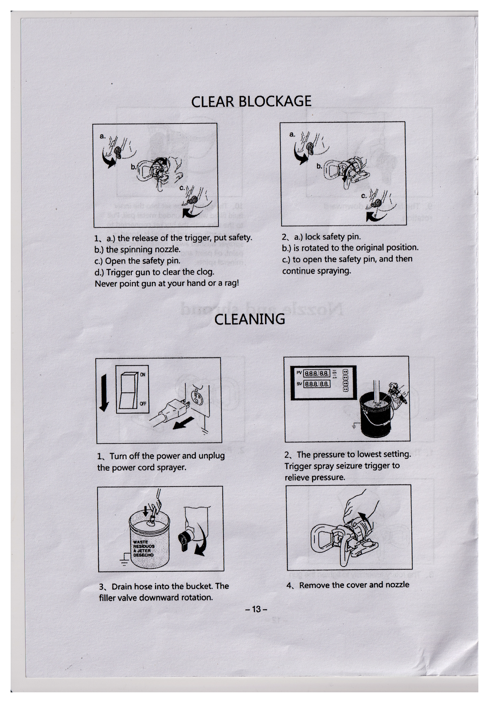
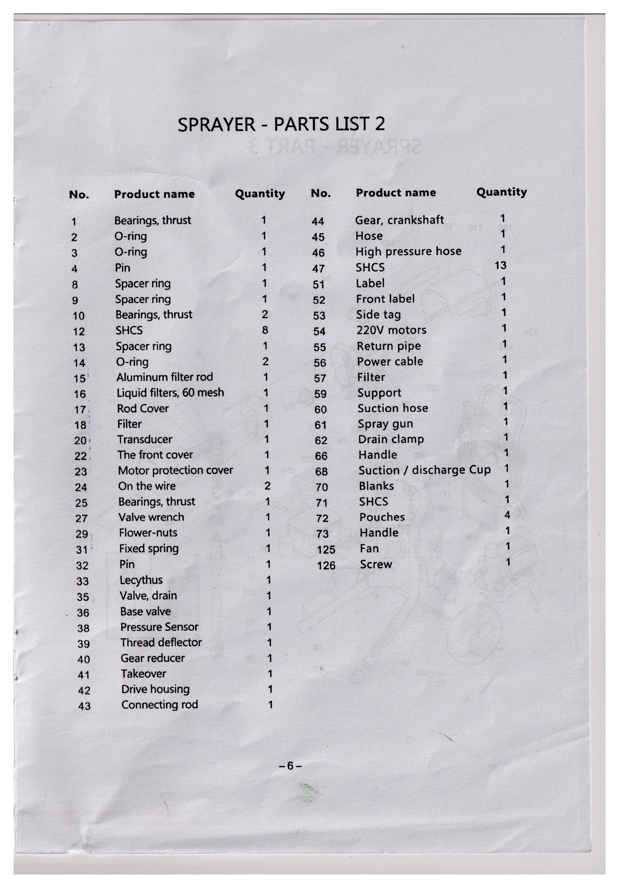
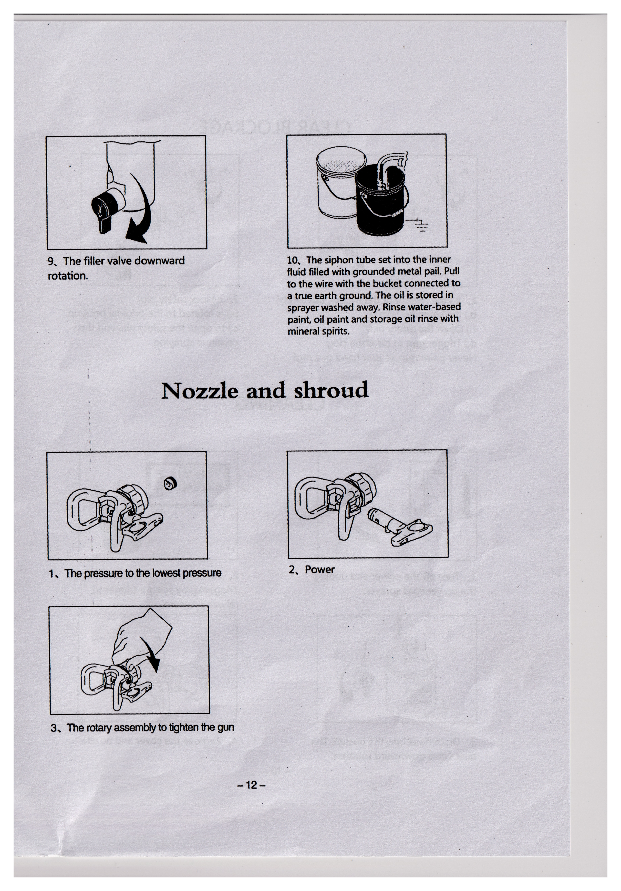
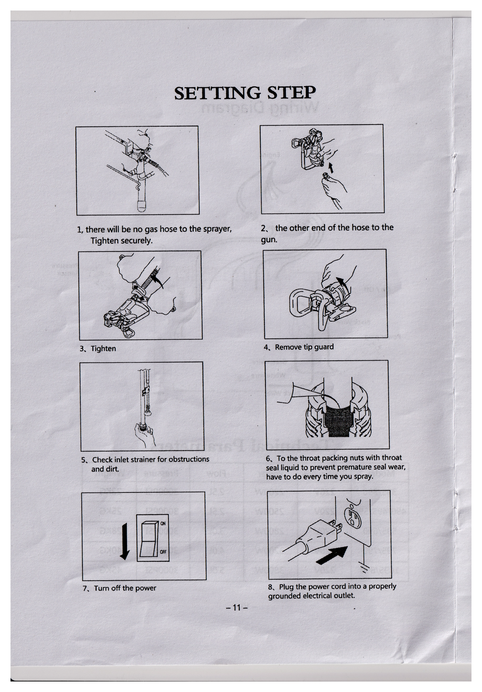
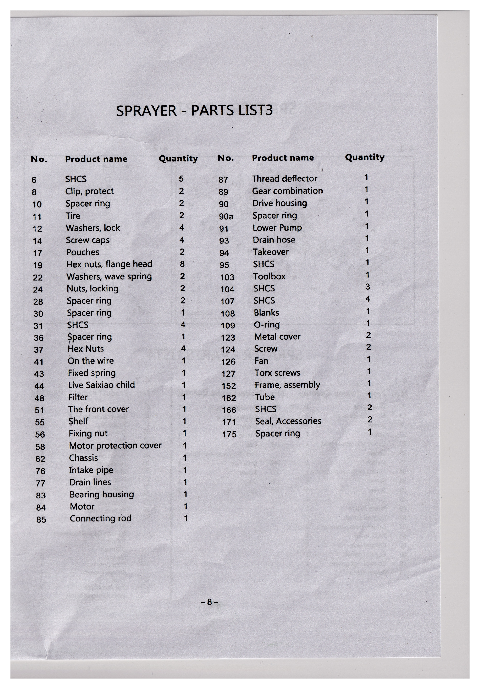

# Manual do Pulverizador - Documento Traduzido

Fonte: `C:/Users/gabri/Downloads/ilovepdf_merged (1).pdf`

Este Markdown foi gerado a partir de um PDF escaneado, sem texto selecionavel. As paginas foram giradas 90 graus para a esquerda, melhoradas em resolucao 2x e separadas em paginas individuais para facilitar leitura. Como o original e uma digitalizacao com dobras e baixa nitidez em algumas listas, os trechos de OCR menos confiaveis foram mantidos junto das imagens refeitas.

## Arquivos gerados

- PDF corrigido em paginas duplas: [documento_corrigido_upscale.pdf](documento_corrigido_upscale.pdf)
- PDF corrigido em paginas separadas: [paginas_separadas_corrigidas_upscale.pdf](paginas_separadas_corrigidas_upscale.pdf)
- Imagens das paginas duplas: [pages-upscaled](pages-upscaled)
- Imagens separadas: [pages-split-upscaled](pages-split-upscaled)

## Paginas corrigidas

### Pagina dupla 1

#### Pagina -13 - Desobstrucao / Limpeza

**Desobstrucao**

1. Na liberacao do gatilho, coloque a trava de seguranca.
2. Para operar a trava de seguranca:
   - Trave o pino de seguranca.
   - Gire de volta para a posicao original.
   - Para abrir o pino de seguranca, continue pulverizando.
3. Nunca aponte a pistola para a sua mao nem para um pano.

**Limpeza**

1. Desligue a energia e desconecte o cabo de alimentacao do pulverizador.
2. Ajuste a pressao para o nivel mais baixo. Acione o gatilho da pistola para aliviar a pressao.
3. Drene a mangueira no balde. Gire a valvula do filtro para baixo.
4. Remova a capa e o bico.

#### Pagina -6 - Pulverizador: lista de pecas 2

| No. | Nome da peca | Qtd. |
| --- | --- | ---: |
| 1 | Rolamento axial | 1 |
| 2 | Anel O-ring | 1 |
| 3 | Anel O-ring | 1 |
| 4 | Pino | 1 |
| 8 | Anel espaciador | 1 |
| 9 | Anel espaciador | 1 |
| 10 | Rolamento axial | 2 |
| 12 | Parafuso SHCS | 8 |
| 13 | Anel espaciador | 1 |
| 14 | Anel O-ring | 2 |
| 15 | Haste de filtro de aluminio | 1 |
| 16 | Filtros de liquido, malha 60 | 1 |
| 17 | Tampa da haste | 1 |
| 18 | Filtro | 1 |
| 20 | Transdutor | 1 |
| 22 | Tampa frontal | 1 |
| 23 | Tampa de protecao do motor | 1 |
| 24 | Fio / cabo interno | 2 |
| 25 | Rolamento axial | 1 |
| 27 | Chave da valvula | 1 |
| 29 | Porca tipo flor | 1 |
| 31 | Mola fixa | 1 |
| 32 | Pino | 1 |
| 33 | Lecythus / copo | 1 |
| 35 | Valvula de drenagem | 1 |
| 36 | Valvula de base | 1 |
| 38 | Sensor de pressao | 1 |
| 39 | Defletor de rosca | 1 |
| 40 | Redutor de engrenagem | 1 |
| 41 | Adaptador / tomada | 1 |
| 42 | Carcaca de acionamento | 1 |
| 43 | Biela | 1 |

## Pagina dupla 2

#### Pagina -7 - Pulverizador: parte 3

Vista explodida do pulverizador, parte 3, com numeracao das pecas. A pagina e majoritariamente ilustrativa; os numeros das chamadas foram preservados na imagem ampliada.

#### Pagina -12 - Bico e protetor

**Bico e protetor**

1. Ajuste a pressao para a pressao mais baixa.
2. Desligue a energia.
3. Aperte o conjunto rotativo da pistola.
9. Gire a valvula do filtro para baixo.
10. Coloque o tubo de succao no recipiente interno com fluido e conecte o fio a um aterramento real. Nao deixe o pulverizador em contato com tinta, oleo ou solventes minerais.

## Pagina dupla 3

#### Pagina -11 - Etapas de configuracao

**Etapas de configuracao**

1. Conecte uma extremidade da mangueira ao pulverizador. Aperte firmemente.
2. Conecte a outra extremidade da mangueira a pistola.
3. Aperte.
4. Remova o protetor do bico.
5. Verifique se ha obstrucoes no filtro de entrada e limpe-o.
6. Aplique liquido selante na porca da gaxeta de garganta para evitar desgaste prematuro da vedacao. Faca isso sempre que for pulverizar.
7. Desligue a energia.
8. Conecte o cabo de alimentacao a uma tomada eletrica devidamente aterrada.

#### Pagina -8 - Pulverizador: lista de pecas 3

| No. | Nome da peca | Qtd. |
| --- | --- | ---: |
| 6 | Parafuso SHCS | 5 |
| 8 | Clipe de protecao | 2 |
| 10 | Anel espaciador | 2 |
| 11 | Pneu | 2 |
| 12 | Arruelas de trava | 4 |
| 14 | Tampas de parafuso | 4 |
| 17 | Bolsas / bolsas de apoio | 2 |
| 19 | Porcas sextavadas com flange | 8 |
| 22 | Arruelas onduladas de mola | 2 |
| 24 | Porcas de travamento | 2 |
| 28 | Anel espaciador | 2 |
| 30 | Anel espaciador | 1 |
| 31 | Parafuso SHCS | 4 |
| 36 | Anel espaciador | 1 |
| 37 | Porcas sextavadas | 4 |
| 41 | Fio / cabo interno | 1 |
| 43 | Mola fixa | 1 |
| 44 | Item identificado pelo OCR como "Live Saixiao child" | 1 |
| 48 | Filtro | 1 |
| 51 | Tampa frontal | 1 |
| 55 | Suporte / prateleira | 1 |
| 56 | Porca de fixacao | 1 |
| 58 | Tampa de protecao do motor | 1 |
| 62 | Chassi | 1 |
| 76 | Tubo de entrada | 1 |
| 77 | Linhas de drenagem | 1 |
| 83 | Alojamento do rolamento | 1 |
| 84 | Motor | 1 |
| 85 | Biela | 1 |

## Pagina dupla 4

#### Pagina -9 - Pulverizador: lista de pecas 4

**Pulverizador - lista de pecas 4**

A imagem contem listas de pecas das secoes 4-1 e 4-2. O OCR desta pagina ficou parcialmente degradado por causa da baixa nitidez e da dobra central. Itens legiveis:

| No. | Nome da peca | Qtd. |
| --- | --- | ---: |
| 9 | Vedacao O-ring | 1 |
| 13 | Parafuso de cabeca soquete | 3 |
| 15 | Anel quadrado | 2 |
| 20 | Vedacao O-ring | 2 |
| 35 | Arruelas de trava com mola | 3 |
| 40 | Transdutor | 1 |
| 50 | Conjunto da alca | 1 |
| 66 | Tampa do filtro | 1 |
| 67 | Filtro | 1 |
| 73 | Plugue autolimpante | 1 |
| 74 | Tubo do filtro | 1 |
| 80 | Valvula metalica | 1 |
| 86 | Sensor de pressao | 1 |
| 92 | Filtro de liquido: malha 30, 60 original, 100 ou 200 | 1 |
| 113 | Coletor / manifold | 1 |
| 114 | Plugue de tubo | 1 |
| 125 | Retentores de oleo / juntas | 1 |
| 162 | Tubo | 1 |
| 171 | Vedacao / acessorios | 2 |
| 172 | Juntas, cotovelo de 45 graus | 1 |

#### Pagina -10 - Diagrama de fiacao e parametros tecnicos

**Diagrama de fiacao**

- Engine: motor
- On / Off: liga / desliga
- Power plug: plugue de alimentacao
- Black wire: fio preto
- Green wire: fio verde
- White wire: fio branco
- Pressure sensor: sensor de pressao
- Potentiometer: potenciometro

**Parametros tecnicos**

| Modelo | Alimentacao | Potencia | Vazao | Pressao | Peso |
| --- | --- | ---: | ---: | ---: | ---: |
| 395/390 | 220 V | 2200 W | 2,5 L | 3000 PSI | 22 kg |
| 490/495/590 | 220 V | 2500 W | 2,5 L | 3000 PSI | 25 kg |
| 595/690 | 220 V | 2800 W | 3,0 L | 3000 PSI | 28 kg |
| 795/790 | 220 V | 3200 W | 4,0 L | 3000 PSI | 40 kg |
| 1095/890 | 220 V | 3800 W | 5,0 L | 3000 PSI | 45 kg |
